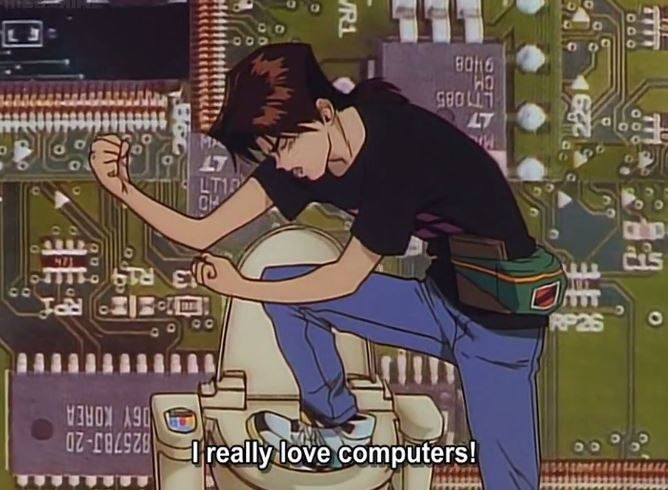

# Bio

Can’t find a description to put here, just that I spend almost all my time on the wired [coding](https://github.com/hihebark), ~~hacking~~, learning new things, listening to good [music](https://soundcloud.com/rm-rfall/sets) and sometimes I go for hiking or just walking and admiring.

## Citations

> Your time is limited, so don't waste it living someone else's life. - unknown
> There is no justice in a world run by corruption. – Julian Assange
> It’s not at all important to get it right the first time. It’s vitally important to get it right the last time. - The Pragmatic Programmer
